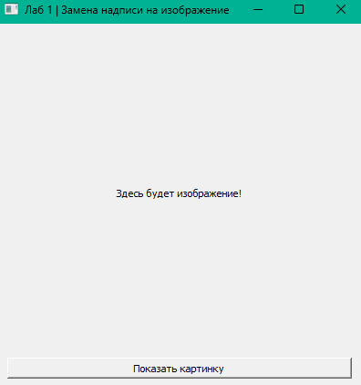

## Лабораторная работа № 1
## Васильев Артём
## Группа 6231-010402D

### Архитектура и принцип работы

Приложение представляет собой графическое окно (GUI) с двумя ключевыми элементами: текстовой надписью (`QLabel`) и кнопкой (`QPushButton`).

**Логика работы:**

1. При запуске создается графический интерфейс. Надпись отображает начальное текстовое сообщение.
2. Кнопка связывается со специальной функцией-обработчиком (**слотом**) через механизм «сигналов и слотов» (`clicked.connect(...)`).
3. Нажатие на кнопку генерирует сигнал `clicked`.
4. Функция-обработчик загружает изображение с диска, масштабирует его с сохранением пропорций и передает в тот же виджет `QLabel`, заменяя стандартный текст графическим объектом.

**Результат работы программы:**

Первый запуск: 

После нажатия на кнопку "Показать картинку":

